# Simple Batch/Streaming Pipeline with Hadoop and Pyspark
The purpose of the project is to learn how to build a data pipeline on Hadoop Cluster and using spark as processing.

## What are we going to do
We're going to prepare data for marketing team to create campaign or promotion for ABC coffee shop. 

## Workflow
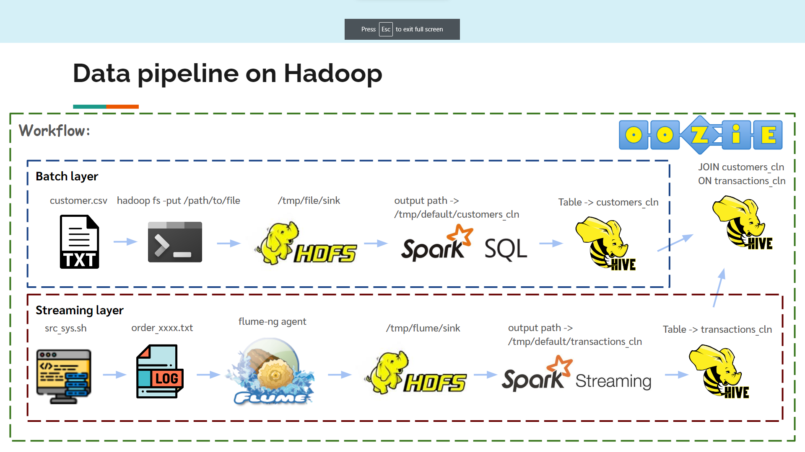

## Customer data (Batch)
(In data/file/source/customer.csv)
```
schema
 |-- customer_id: int
 |-- store_id: int
 |-- customer_firstname: string
 |-- customer_email: string
 |-- customer_since: string
 |-- loyalty_card_number: string
 |-- birthdate: string
 |-- gender: string
 |-- birth_year: int
```

## Transactional data (Streaming)
We will use Shell Script to mock transactional data  
(In data/flume/src_sys.sh) 
```
schema
 |-- customer_id: int
 |-- customer_order: int
 |-- order_timestamp: bigint
```

## After JOIN Table
```
schema
 |-- cust_id: int
 |-- cust_name: string
 |-- cust_member_card_no: string
 |-- spnd_amt: int
```

## How to do this
Note: To do this you need access to a project that links to Billing Account. (There is Free Trial if you're new to Google Cloud)
<br>

1. Create instance on Compute Engine [See Documentation](https://cloud.google.com/compute/docs/instances/create-start-instance#startinstanceconsole)

2. Create firewall rule for TCP access (port: 7180 -> Cloudera Manager, port: 8888 -> Cloudera Hue)

3. Attach the firewall rule to the instance

4. Connect to you instance via SSH and install docker  

    Note: If you use Ubuntu 18.04 LTS as Operating System in your instance, you can follow these steps  

    **Step 1:** Installing Docker
    ```
    sudo apt update
    ```
    Install a few prerequisite packages which let `apt` use packages over HTTPS
    ```
    sudo apt install apt-transport-https ca-certificates curl   software-properties-common
    ```
    Add the GPG key for the official Docker repository to your system
    ```
    curl -fsSL https://download.docker.com/linux/ubuntu/gpg | sudo apt-key add -
    ```
    Add the Docker repository to APT sources
    ```
    sudo add-apt-repository "deb [arch=amd64] https://download.docker.com/linux/ubuntu bionic stable"
    ```
    ```
    sudo apt update
    ```
    Make sure you are about to install from the Docker repo instead of the default Ubuntu repo
    ```
    apt-cache policy docker-ce
    ```
    ```
    sudo apt install docker-ce
    ```
    Check your docker that it's running
    ```
    sudo systemctl status docker
    ```
    **Step 2:** Executing the Docker command without sudo (Optional)  

    Note: If you forgot password of your user
    ```
    sudo passwd $USER
    ```
    then
    ```
    sudo usermod -aG docker $USER
    ```
    re-login to apply the new group membership
    ```
    su $USER
    ```
    Confirm that your user is now added to the docker group
    ```
    id -nG
    ```

5. Pull mikelemikelo/cloudera-spark image to your VM  [Link on dockerhub](https://hub.docker.com/r/mikelemikelo/cloudera-spark)
    ```
    docker pull mikelemikelo/cloudera-spark
    ```
6. Run container
    ```
    docker run --hostname=quickstart.cloudera --privileged=true -t -i -p 8888:8888 -p 7180:7180 -p 88:88/udp -p 88:88 mikelemikelo/cloudera-spark:latest /usr/bin/docker-quickstart-light
    ```

7. Run cloudera-manager
    ```
    sudo /home/cloudera/cloudera-manager --express && service ntpd start
    ```

8. Login Cloudera Manager through External IP (user, passwd = cloudera)  

    It should look like this 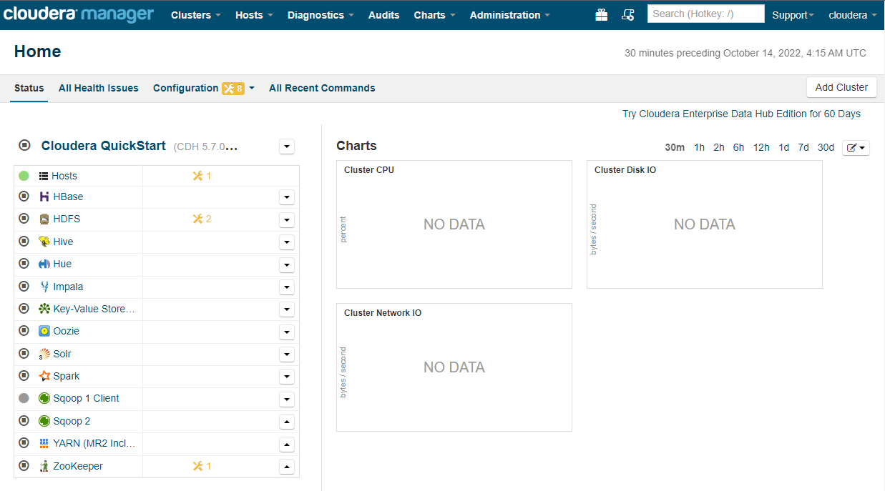

9. Set Hive Configuration, Spark On YARN Service = none, Delete unused service such as KV Indexer and Spark (We're going to use spark that already installed in container [See Dockerfile](https://github.com/mikelemikelo/cloudera-spark)

10. Add service Flume, Start cluster, and Wait  

11. Detach from container (Ctrl+P Ctrl+Q) and Clone this repo to your VM
    ```
    git clone https://github.com/jakgritde/simple-batch-and-streaming-pipeline-with-hadoop-and-pyspark-on-Compute-Engine.git simple-hadoop
    ``` 

12. Copy all files in data folder to container
    ```
    docker cp simple-hadoop/data [CONTAINER_ID]:/  
    ```

***(In Batch Layer)***  
**Step 1:** Put batch data (customer.csv) to HDFS
```
hadoop fs -mkdir /tmp/file
```
```
hadoop fs -mkdir /tmp/file/sink
```
```
hadoop fs -put /data/file/source/customer.csv /tmp/file/sink
```
**Step 2:** Create table in Hive
```
hive -f /data/sql/create_hive_customers.sql
```
**Step 3:** Check data
```
hive -e "SELECT * FROM customers LIMIT 5;"
```
or Run query on HUE Query Editors
```sql
SELECT * FROM customers LIMIT 5;
```
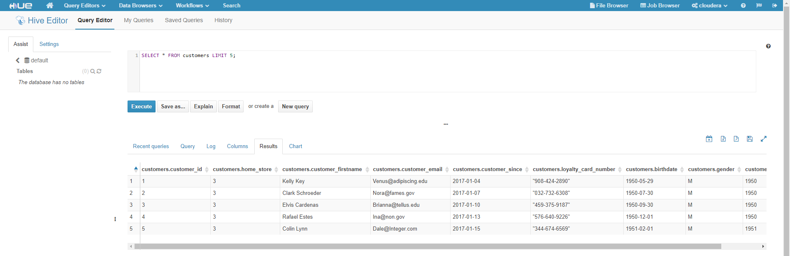

**Step 4:** Clean data using spark
```
spark-submit /data/spark/spark.py
```
**Step 5:** Check the result
```
hive -f /data/sql/create_hive_customers_cln.sql
```
```sql
SELECT * FROM customers_cln LIMIT 5;
```
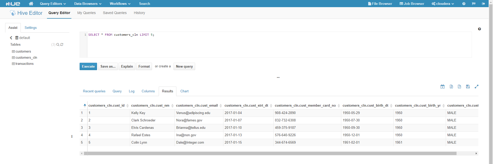

***(In Streaming Layer)***  
**Step 1:** Create streaming data from src_sys.sh then Put it to HDFS
```
cd /data/flume/source
```
```
mkdir hdfs
```
```
hadoop fs -mkdir /tmp/flume
```
```
hadoop fs -mkdir /tmp/flume/sink
```

**Step 2:** Back to docker prompt and Run Flume jobs
```
nohup flume-ng agent -n tier1 -f /data/flume/source/flume_hdfs.conf &
```
<u>Tip!</u> nohup . . . & is for running in background.

```
nohup sh /data/flume/src_sys.sh &
```

**Step 3:** Check data
```
hive -f /data/sql/create_hive_transactions.sql
```
```sql
SELECT * FROM transactions LIMIT 5;
```
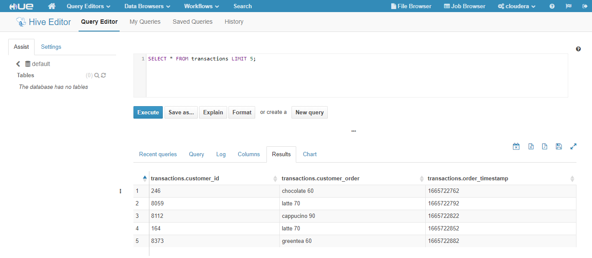

**Step 4:** Clean data using spark-streaming
```
nohup spark-submit /data/spark_streaming/spark_streaming.py &
```

**Step 5:** Check the result
```
hive -f /data/sql/create_hive_transactions_cln.sql
```
```sql
SELECT * FROM transactions_cln LIMIT 5;
```
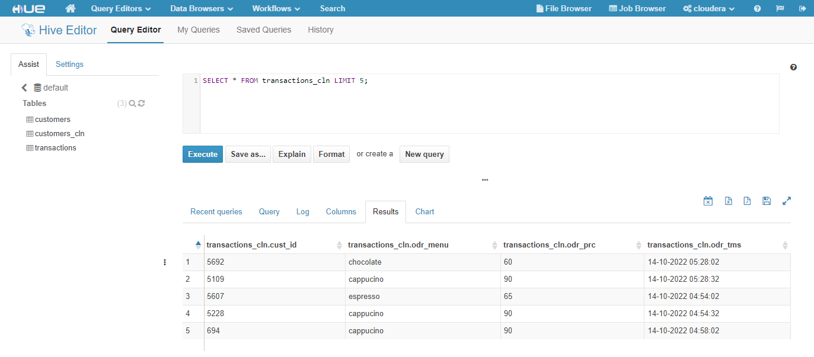

***(Join Table using Ozzie)***  
**Step 1:** Create loyalty table
```
hive -f /data/sql/create_hive_loyalty.sql
```
```
hadoop fs -chmod 777 /tmp/default/loyalty
```

**Step 2:** Put insert script to HDFS
```
hadoop fs -put /data/sql/insert_hive_loyalty.sql /tmp/file
```

**Step 3:** Create Workflow using Oozie on Cloudera HUE web UI  

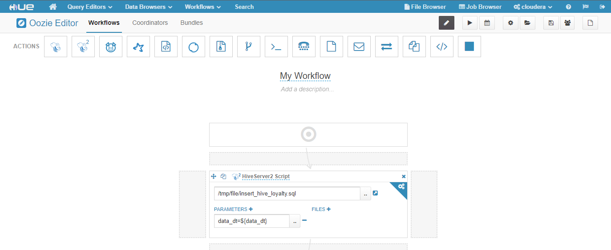

**Step 4:** Create Coordinator  

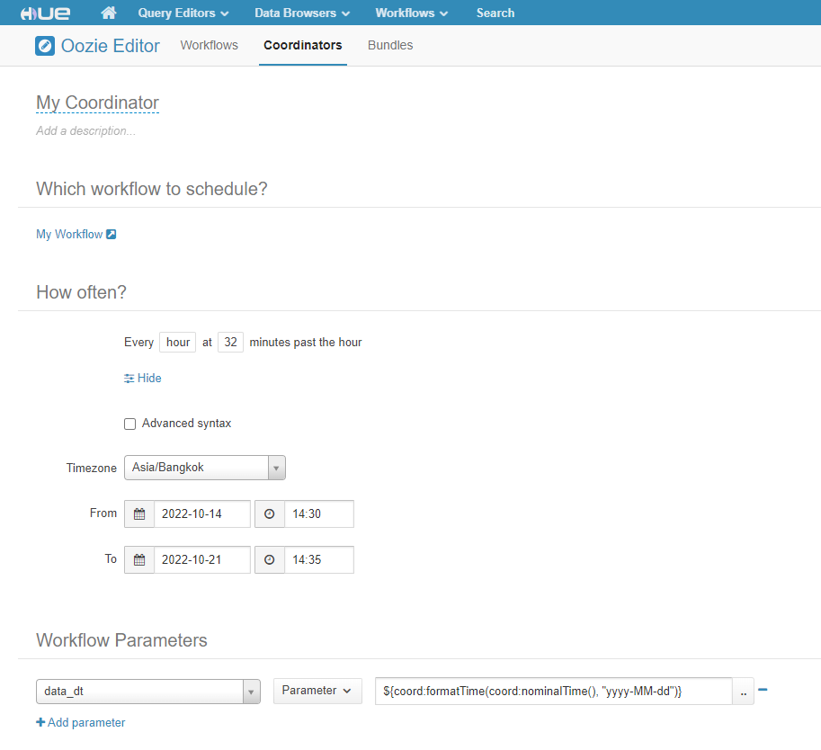

**Step 5:** Submit job  

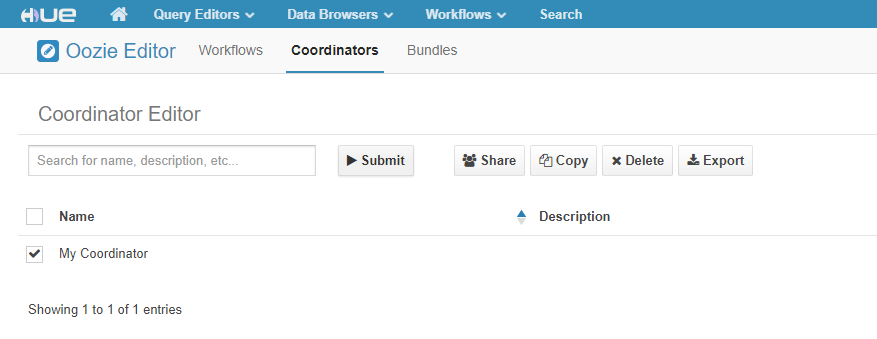

When job is succeeded it should look like this  
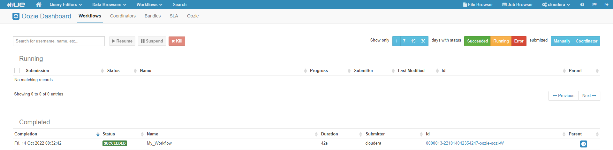

**Step 6:** Check the result  

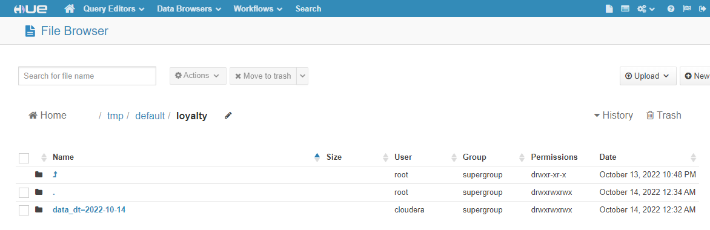
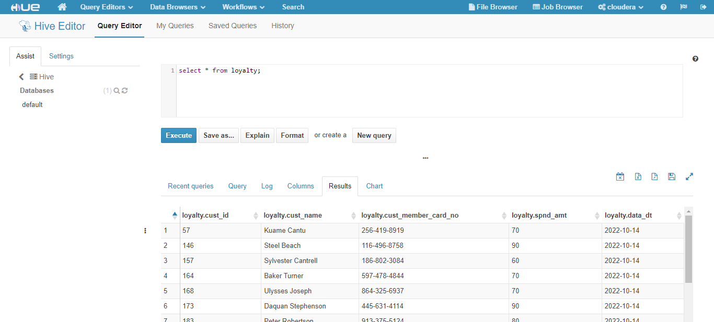

All DONE!!!